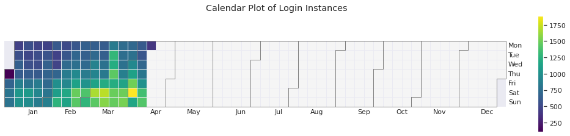

# Data Analysis Interview Challenge
This a mock take-home challenge for data wrangling, exploratory, data analysis, feature engineering, and modeling. `ultimate_data_science_challenge.pdf` contains its instructions. The following is a summary of work:
 
# Part 1 - Exploratory Data Analysis

In `notebooks/logins_eda.ipynb`, we analyze ride-sharing demand by visualizing time series data containing user logins for a ride-sharing application called Ultimate.

Sampling by 15 minutes, we observe a weekly pattern where logins are typically low during the start of the work week and increase on the weekends. This is aligned with common sense in that customers may be more likely to go out on the weekend than a work day and would therefore require transportation. There may exist some seasonality as well, since there is typically more demand in the months of March and April than there are in January and February. This is also intuitive since people go out more frequently during warmer weather.

We plot the mean number of logins by hours, where each individual line represents a day of the week. Darker hues indicate week days later in the week. There is high demand in the early morning hours of Saturday and Sunday. In the late evening, there is comparable demand on Thursday, Friday, and Saturday, but not much on Sunday night.

# Part 2 - Experiment and Metrics Design

The neighboring cities of Gotham and Metropolis have complementary circadian rhythms: on weekdays, Ultimate Gotham is most active at night, and Ultimate Metropolis is most active during the day. On weekends, there is reasonable activity in both cities.

However, a toll bridge, with a two­-way toll, between the two cities causes driver partners to tend to be exclusive to each city. The Ultimate managers of city operations for the two cities have proposed an experiment to encourage driver partners to be available in both cities, by
reimbursing all toll costs.

1. What would you choose as the key measure of success of this experiment in
encouraging driver partners to serve both cities, and why would you choose this metric?

There are a few key measures to consider. The primary measure could be **the ratio of drivers' time spent in Gotham and drivers' time spent in Metropolis**, where this value should be as close to 1 as possible.

Secondary measures could be:
- **The number of toll transactions by driver partners**: Reimbursed toll costs should increase the number of entries through toll booths. We should see a stark causal impact on this metric.
- **The average wait time for riders in Gotham and Metropolis during rush hours**: If drivers are taking advantage of the decreased friction between Gotham and Metropolis, supply should increase during the most active periods in both cities, thereby reducing wait time for riders.
- **Total revenue**: More driver supply to satisfy demand, yields more total revenue. However, there are several factors that contribute to revenue, so this shouldn't be our main measure.

2. Describe a practical experiment you would design to compare the effectiveness of the
proposed change in relation to the key measure of success.

The goal of the experiment would be to determine if the ratio of drivers' time spent in Gotham over the driver's time spent in Metropolis is significantly greater or less than 1. However, achieving a perfect balance between the two is unlikely and impractical. It may be better to see if the average Gotham city utilization and the average Metropolis city utilization are both significantly below 100%.

We can design an experiment where we maintain two groups: Control (no toll transactions reimbursed) and an experimental group (toll transactions reimbursed), with all other conditions controlled (region, experience, time of year). To ensure that the time of year, weather patterns, and other external conditions that affect driving are invariant, we can run these groups concurrently. We then measure the results by a two-tailed z-test.

Caveats: 
- We must gather more than 50 samples to satisfy the conditions of the z-test, which should not be an issue for a large ride-sharing company
- We assume that both groups are normally distributed

# Part 3 - Predictive Modeling

## Exploratory Data Analysis
In `notebooks/rider_retention_01_eda.ipynb`, we visualized features with the interest in predicting rider retention. We analyzed 50000 observations across 12 features (3 categorical, 2 datetime, 7 numerical). 

Using the last trip taken date feature, we derived a target variable called `is_active` that represented whether the user has taken a ride within the last 30 days. By this definition, only about 37.6% users were retained. 

Because there existed a 62:38 ratio of non-active to active users, we considered resampling techniques in our modeling phase to combat class imbalance.

Major insights:
- More than 99.5% of active users have not been on the platform at least 6 months
- The average driver rating, average rating given by the driver, and the phone device contained a relatively small amount of missing values. We eventually imputed these missing values using the feature's median.
- Categorical features demonstrated the most obvious discrimination between active and in-active users
- Over 80% of active users own an iPhone compared to about 60% of non-active users
- About 34% of active users live in King's Landing compared to about 12% of non-active users
- About 70% of non-active users have not used the ultimate black ride option, compared to 50% of active users
- Distance and weekday percentage demonstrated the largest difference between active and non-active users
- Unsurprisingly, we found that surge multiplier and the percentage of surge-priced trips were highly correlated
- No single pair of numerical features produced noticeable discrimination between active and non-active users

## Modeling
We are instructed to build a predictive model to help Ultimate determine whetehr or not a user will be active in their 6th month in the system. In `notebooks/rider_retention_02_modeling.ipynb`, we perform feature engineering, modeling, and hyperparameter optimization.

### Approach

#### Feature Engineering

Feature engineering involved:
- Imputing categorical features with their most frequently occurring value and numerical features with their median
- One-hot encoding categorical features
- Log-transforming and standard-scaling numerical features
- Extract the day of sign-up from the signup-date feature
- Remove one feature of a pair of correlated features that have a absolute Pearson correlation coefficient greater than 0.7

#### Re-sampling
We use random oversampling to combat our class imbalance.

#### Model Selection
We run 5-fold cross-validation on logistic regression, naive bayes, K-nearest neighbor, and random forest classifiers and output their mean averages for f1-score, precision, recall, accuracy, and ROC AUC. Random forest yielded the highest averages in every evaluation metric:

|           |         0.0 |         1.0 |   accuracy |   macro avg |   weighted avg |   roc auc |
|:----------|------------:|------------:|-----------:|------------:|---------------:|----------:|
| f1-score  |    0.837095 |    0.848621 |    0.84307 |    0.842858 |       0.842858 |  0.844933 |
| precision |    0.870243 |    0.819623 |    0.84307 |    0.844933 |       0.844933 |  0.844933 |
| recall    |    0.806387 |    0.879753 |    0.84307 |    0.84307  |       0.84307  |  0.844933 |
| support   | 4991.4      | 4991.4      |    0.84307 | 9982.8      |    9982.8      |  0.844933 |

#### Hyperparameter Optimization

We tuned hyperparameters for our initial random forest model using Optuna. We ran 2 studies, maximizing for f1-score and ROC AUC.

### Results

|           |         0.0 |         1.0 |   accuracy |    macro avg |   weighted avg |   roc auc |
|:----------|------------:|------------:|-----------:|-------------:|---------------:|----------:|
| precision |    0.813717 |    0.67412  |     0.7594 |     0.743919 |       0.761215 |  0.743919 |
| recall    |    0.796762 |    0.697421 |     0.7594 |     0.747092 |       0.7594   |  0.743919 |
| f1-score  |    0.805151 |    0.685572 |     0.7594 |     0.745362 |       0.760177 |  0.743919 |
| support   | 6239        | 3761        |     0.7594 | 10000        |   10000        |  0.743919 |

Our model was able to identify about 70% of active users and 80% of non-active users.

Using ensemble methods, we often trade model performance for interpretability. The above are feature importances among the ensemble of trees in the random forest. No one feature has a dramatically large importance relative to the others, except average distance traveled.

We explore a prediction path for a single positive observation that was classified correctly:

The log-transformed, scaled average rating by driver feature offers a large positive contribution

### Concerns
It's uncertain that my model is valid because there exist concerns about the data on which it had been trained.

The data only ranges 6 months, where more than 99% of the observations have not yet reached an account age of 6 months (based on the difference between last trip and sign-up dates).

The aggregate metrics (avg_surge, avg_rating_by_driver, avg_rating_of_driver, avg_dist, etc.), I assume, are based on the entire 6-month sample of data. In a practical setting, where we are most interested in early predictors of 6-month retention, we would not have a full 6-months-worth of data. A better approach could be to construct a sample dataset of only 1-3 months of user metrics and provide a target label indicating whether or not they were retained after 6 months. A model would then be able to learn to detect early predictors without being biased by data they would otherwise not see in a real use case.

## Key Insights

To improve long-term retention, Ultimate should initially explore the key predictors for our best-performing model:
- Average distance: 
- Average rating by driver
- Signup day: 
- Weekday percentage
- City - King's Landing 

As mentioned earlier, re-training this model on a sample dataset that isn't exposed to 6-month data would better suit the problem they are trying to solve.